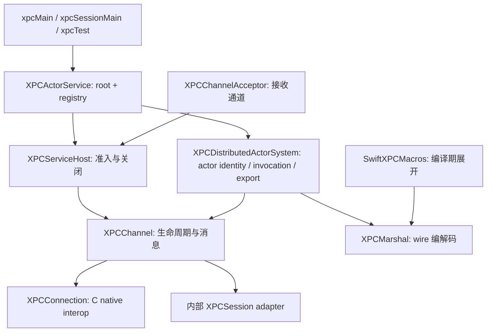

# PR #10 架构复审与重设计

复审基线：`31ee515`（PR #10 原始 HEAD）。本次允许破坏性 API 变更；以下描述当前工作树的设计。

## 复审结论

原 PR 统一了两种后端的表面接口，但仍让上层依赖后端类型、全局配置和不同的生命周期规则。
关键问题已经在此次重设计中处理。阻塞派发与私有 actor 解析属于此前已有的问题，
并非本 PR 新引入：

| 优先级 | 原实现与触发条件 | 影响与修复 |
|---|---|---|
| P1 | `XPCSessionChannel` 用两个锁分别管理 incoming handler 和 pending messages；安装 handler 可以发生在 receive 检查之后、append 之前 | 消息留在缓冲区而没有后续 flush。改为一份 inbox 状态、逻辑激活门控和串行 drain |
| P1 | Session 还未创建时调用 cancel，只取消非空 native session | 没有 invalidation，`waitForDisconnection` 永久等待。取消在所有阶段都结束本地生命周期 |
| P1 | Session 取消时只完成激活前的 pending sends | 已发出请求的 continuation 依赖 native reply；未回复的请求可能继续等待。显式跟踪并结束全部 in-flight sends |
| P1 | accept callback 内把交付任务发到 global queue | 任务可能先于 callback 返回，用户发送会触发 native API misuse。交付排到 listener 的同一串行 target queue |
| P1 | Session listener 在 deinit 中永久 `passRetained` | 每个 export listener 都泄漏。实跑确认 inactive listener 的 cancel/dispose 顺序触发 `_xpc_connection_last_xref_cancel`；取消时先完成激活要求，再正常释放 |
| P1 | `XPCSendSink.finish` 在 install 之前允许覆盖已存 outcome | 取消和回复竞争时，后来的结果覆盖先到结果。首次 outcome 一经提交就不可覆盖 |
| P1 | Session endpoint factory 直接构造 `XPCEndpoint` | 非 endpoint 输入可能触发 overlay precondition。两后端在工厂边界都抛 `XPCMarshalError` |
| P1 | actor dispatch 用 semaphore 等待 async 方法结束 | 悬挂调用会堵住 XPC event queue，妨碍 invalidation 和关闭。改为每通道一条有序 Task 链 |
| P1 | 私有 actor 的 mangled name 含哈希 `…C03F0B…` | 方法名启发式解析误得 `F0B()`。用 actor metadata 验证候选，继续扫描真实方法名 |
| P2 | `XPCIncomingMessage` 声称只能回复一次但未实施 | 复制 message 后仍可重复回复。共享一次性 capability，重复回复忽略 |
| P2 | root system 为维持进程全局 singleton 创建闲置 C connection，且逐 peer 修改 export transport | 注册表生命周期与 transport 耦合；服务实例相互干扰。root 和 registry 由具体服务实例持有，transport 构造时确定 |
| P2 | actor import 读取可变 `processDefault`；`connect(using:)` 不从 channel 推导系统 transport | Session root 的子引用可能悄悄切换到 C；测试并发修改策略会互相影响。嵌套解码继承调用 system 的 transport，独立导入可显式指定 |
| P2 | `retrying` 同时重试 invalid 和 session 错误；resolve 后立即发 connected | 终局错误被无效重试，本地代理创建被当作已连接。只重试 C interruption；初始事件改为 ready |

## 职责与依赖



| 层 | 负责 | 边界 |
|---|---|---|
| 序列化 | `XPCMarshal` 和宏；原始 XPC payload / wire envelope | 编解码布局独立于连接与宿主；本次 wire version 不变 |
| transport | `XPCChannel`、`XPCChannelTransport`、`XPCChannelAcceptor` | 一个具体 owned channel；后端只在内部 enum 中分派，不开放需要猜测能力的 existential 协议 |
| 服务准入 | `XPCServiceHost` 与 `XPCServiceDelegate` | 只处理 requirement、audit、peer bookkeeping、shutdown；不构造 actor，也不选择 listener |
| actor runtime | `XPCDistributedActorSystem` | 本地 registry 不需要 outbound channel；代理 system 从 channel 取得 transport；负责 dispatch / export / import |
| 服务组装 | `XPCActorService<Root>` | 每实例一个 root、一个 local system、一个 host；root factory 支持依赖注入 |
| 入口与测试 | `xpcMain`、`xpcSessionMain`、`xpcTest` | 选择 listener 与进程退出策略；测试只增加 watchdog、事件等待和模拟断连 |

`XPCConnection` 保留为低层 native interop API。通用应用使用 `XPCChannel`；C 专属操作显式经
`channel.connection` 访问。`pid/euid/egid/asid` 在 channel 上提供可选值，不再需要
`XPCPeerContext`；accepted peer 的身份在 channel 中保留快照，关闭后仍可审计。宿主也不再用 `as? XPCConnection` 猜后端。

服务 delegate 不再要求 `init()`，也不承担 `@main` 的入口职责；只有 `XPCApp` 要求可默认构造。

## 生命周期契约

- channel 的逻辑状态是 inactive → active → invalid，cancel 可在任何状态调用；activate 幂等。
- 两种 acceptor 都交付需要逻辑 activate 的 channel。Session 在 native callback 返回后已由系统激活，
  但库层在准入完成前缓冲 incoming messages，避免 handler 安装与交付竞争。
- acceptor 状态锁只决定原生操作的执行方，`activate/cancel` 均在锁外执行；取消与激活重叠时，
  先停止准入，再由激活调用完成原生取消，避免取消先于激活或重复激活。
- listener 的 Session handler 配置仍在 accept callback 内完成；交付排到同一 target queue，确保
  native decision 已返回。[Apple 的 accept 文档](https://developer.apple.com/documentation/xpc/xpclistener/incomingsessionrequest/accept(incomingmessagehandler:cancellationhandler:)-48c3k)
  明确返回的 inactive session 是用于这个配置窗口。
- 激活前发送缓冲。Session 的 enqueue 与激活 flush 使用同一 control lock 决定顺序，再到 serial
  send queue 执行，避免后发消息越过激活前消息。
- 取消 awaiting task 结束自己的 continuation，不撤回已经提交给 peer 的请求；channel 仍可使用。
  取消 channel 则结束整个 channel，Session 的全部 in-flight sends 也立即失败。
- invalidation 一次投递并释放 handler captures；晚注册 handler 立即补发。C interruption 可以重复；
  Session 的所有 peer loss 均是 terminal invalidation。
- host 先注册 peer，再安装带 replay 的 invalidation handler；不在 host state lock 内激活 channel，
  避免同步 invalidation 重入死锁。handler 保留 channel 至事件交付，终局事件清除这条引用链。
- actor invocations 按通道 FIFO 执行，等待异步方法时不阻塞 transport 回调队列。此顺序仍是严格的：
  业务代码若等待同一通道排在自身后面的 invocation，会形成业务层循环等待。

## root、导入策略与所有权

root 是 **每个服务实例一次构造**，所有接受的 root peers 绑定同一个 actor。不同服务实例可以在
同一进程内各自拥有 `.root`，因为 identity 的命名空间是各自的 system。生产和测试使用同一组装路径。

`XPCActorService(makeRoot:)` 在构造时保留 root identity，调用 factory 后校验 root 及所属 system。
`cancel()` 结束 peers 和 export sessions，并释放 registry pins。peer 断开不会结束整个服务，也不会
使别的客户端或已导出的子 actor 失效。

system 的 transport 构造后不可变。返回值中的引用在 reply decoding 范围继承客户端 system 的策略；
参数中的引用在服务端 argument decoding 范围继承服务端 system 的策略。Task-local 解码上下文仅覆盖
解码操作及其嵌套 `XPCMarshal`，没有可变进程默认值。独立调用：

```swift
let actor = try Worker.unmarshal(from: payload, transport: .session)
```

协议要求的 `unmarshal(from:)` 在上述 runtime 范围之外使用固定 C 默认值。endpoint 本身仍支持
跨后端互操作；本地选择不写进 wire。

`XPCChannel` 是拥有资源的引用类型，最后一个 channel 引用销毁时取消 native channel。
actor system 保留所用的 channel，省去 `ownsConnection` / `allowsChildReclamation` 配置组合。
本地 registry 在 export peers 全部 drain 后尝试释放子 actor 的 pin；root 保留至 service 结束。

## 破坏性迁移

| 旧 API | 新 API |
|---|---|
| `any XPCMessageChannel` | `XPCChannel` |
| 公共 `XPCSessionChannel(...)` | `XPCChannelTransport.session.channel(...)` |
| delegate 的 `XPCPeerContext` | delegate 的 `XPCChannel` |
| `peer.channel` | `peer` |
| transport 上的 `processDefault` | 显式 transport；runtime 嵌套引用自动继承 |
| `XPCRootActor.shared` / `XPCDistributedActorSystem.serviceHost` | `XPCActorService.root` / `.system` |
| `XPCServiceHost(rootType, delegate)` | `XPCActorService(rootType, delegate).host`；必须保留 service |
| 用 idle connection 创建本地 system | `XPCDistributedActorSystem(transport:)` |
| `system.connection` 永远非空 | 代理 system 非空；本地 registry 为 nil |
| channel `send(payload, replyQueue:)` | `send(payload)`；native C API 仍支持 reply queue |
| `XPCRootConnectionEvent.connected` | `.ready`：本地代理就绪，首次调用才建立通信 |
| `XPCServiceDelegate.main()` | `XPCApp` 或显式 `xpcMain` |
| 对 invalid / session 错误重试 | 仅 C `.interrupted` 重试 |

Session adapter 目前对任何非 nil requirement 都以 `ENOTSUP` 失败；新的系统版本拥有 native
requirement API 不代表本库已经支持。身份审计或强鉴权服务使用 C backend。

## 验证

验证覆盖原有布局、宏、dispatch、actor reference、forwarding、peer audit、root recovery 和关闭测试，
以及四种 server/client backend 组合。新增回归覆盖：

- 未激活 channel/listener 取消、缓冲 reply 结束和断连等待；
- C / Session acceptor 并发激活与取消，验证取消终局与原生释放顺序；
- 取消早于 continuation 安装时的首次结果保证；
- message 多个副本的并发一次性回复；
- 非法 endpoint 在两后端都抛错误；
- 私有 actor 哈希干扰方法解析；
- 悬挂 invocation 时 peer invalidation 与本地 in-flight send 结束；
- 多个服务实例 registry 隔离及同一服务 root 共享；
- Session 子引用继承 backend 和终局错误不重试。

最终验证已通过：

- `SWIFTXPC_WARNINGS_AS_ERRORS=1 swift test`：主套件 160 tests；transport 套件 13 tests，
  其中 11 项运行四种 backend 组合、一项并发生命周期测试运行两后端，另有 Session requirement fail-closed 测试。
- `swift format lint --strict --recursive Sources Tests`、`git diff --check` 无问题。
- `Examples/DistributedXPCDemo` 的 warnings-as-errors 独立 package 构建通过。

这些结果来自当前 macOS 26 本机；未以旧 PR HEAD 的 CI 结果替代本地验证。
